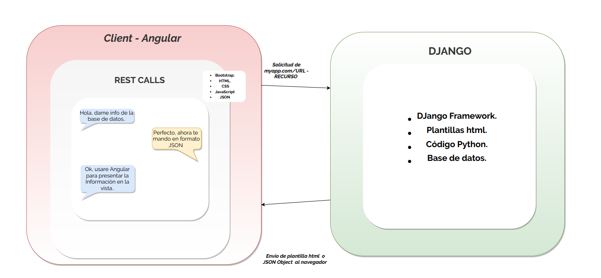

# Django Web Project


---

##  Tabla de contenidos


- [Introduccíon](#Introducción)
- [About](#About )
- [Arquitectura](#Arquitectura)
- [Instalación](#instalación)
- [Características](#Características)
- [Team](#team)
- [Anexo](#Anexo)


---

 
## Introducción

-  🇬🇧 ENG - The main goal of this project is to work ..
              
  - 🇪🇸 ESP - Desarrollo de una sencilla aplicacion en Django que pueda consultar una base de datos, hacer operaciones sencillas, responder a solictudes del front y consultar alguna API REST.
 
---
 ## About

  -  This is a Django  project developed by [Jhosef A. Cardich Palma](https://www.linkedin.com/in/jhosef-anderson-cardich-palma-74765788/). 
     
 
 ---
## Arquitectura

La implementación general se ha seguido un patrón ***Modelo Vista Controlador (MVC)*** , para definir los componentes y sus interacciones. 
Let's take a look how this architecture looks like:

 ***Organización del proyecto***
- Se cuenta con una aplicación Java,una base de datos SQLite3, y algún cliente a desarrollarse. 
> Esta es una primera version de lo que podría ser 
 


## Instalación

 - El proyecto se iniciara mediante [Django](https://maven.apache.org/) para la organización de las dependencias y Python para el desarrollo del back-end. 

 #### Configuración Entorno
-  Se usa el entorno de desarrollo PyCharm.

 - Configuración Django en OSX 

> Instalación Django 
```
$ brew install python
 ```
> Después de instalar Python, abrir el shell de Python
```
$ python
 ```
> Instalación Django:


```
>>> import django
 ```


---
 

## Características

Se irán definiendo dentro durante el proyecto


#### Consultas a una base de Datos SQLite3
- Se puede diseñar alguna especie de carrito de la compra, para la sesión de un cliente en el que se puede llevar la compra actual, checkeando la disponibilidad del producto.

````
- Agregar un articulo al carrito.
- Quitar un producto de carrito.
- Terminar la sesión de compra.
````


## Dependencias

Los siguientes paquetes de software son necesarios en el sistema para poder hacer funcional la aplicación:
- [Python 3 ](https://www.python.org/downloads/)
- [Django](https://www.djangoproject.com/)


## Team
> Contributors/People

| <a href="https://www.linkedin.com/in/jhosef-anderson-cardich-palma-74765788/" target="_blank">**Jhosef A. Cardich Palma**</a> | 
| :---: |
|  <a href="https://www.linkedin.com/in/jhosef-anderson-cardich-palma-74765788/" target="_blank"></a>   |
|***Full-Stack Software Developer***|
| Linkedin:   <a href="https://www.linkedin.com/in/jhosef-anderson-cardich-palma-74765788/" target="_blank">` Jhosef A. Cardich Palma`</a>| 
| Twitter: <a href="http://twitter.com/jhosefcardich" target="_blank">`@JhosefCardich`</a>| 
|Instagram: <a href="http://instagram.com/arts_hot" target="_blank">`@ARTS-HOT`</a>

---
## Anexo

Cuando se quiera implementar un proyecto en Django por primera vez seguir los siguientes pasos:

> 1 - Iniciar un proyecto en django: Nos situamos en la carpeta del proyecto y en una terminal escribimos
```
$ django-admin startproject 'myproyectocool'
 ```

> 2 - Configurar una base de datos SQLite3 sencilla.. 
```
$ python3  manage.py migrate
 ```

> 3 - Visualizar el funcionamiento del servidor, con un servidor de desarrollo sencillo 
```
$ python3  manage.py runserver
 ```
 - Entonces podremos observar el siguiente mensaje: 

```
Django version 3.0.7, using settings 'web_python_django.settings'
Starting development server at http://127.0.0.1:8000/
Quit the server with CONTROL-C.
```
